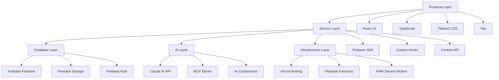

# 📖 Moonwave Plan Reader's Guide

> **Complete Documentation & Navigation Guide for Moonwave Plan**  
> 가족과 함께하는 스마트한 할일 관리 - 종합 이해 가이드

---

## 🎯 이 문서의 목적

이 **Reader's Guide**는 Moonwave Plan 프로젝트를 완전히 이해하고자 하는 모든 사람들을 위한 종합 안내서입니다.

**대상 독자:**
- 👨‍💻 **개발자**: 프로젝트 구조와 기술적 구현 이해
- 🏢 **프로젝트 매니저**: 기능과 비즈니스 로직 파악
- 🎨 **디자이너**: UI/UX 구조와 디자인 시스템 이해
- 🔍 **QA/테스터**: 테스트 범위와 기능 검증 방법
- 📊 **비즈니스 분석가**: 요구사항과 사용자 시나리오 분석
- 🚀 **DevOps 엔지니어**: 배포와 인프라 구조 파악

---

## 🗺️ 문서 네비게이션

### 📚 **핵심 문서**

| 문서 | 목적 | 대상 독자 |
|------|------|----------|
| [README.md](../README.md) | 프로젝트 개요 및 빠른 시작 | 모든 사용자 |
| [이 문서 (reader.md)](./reader.md) | 종합 가이드 및 네비게이션 | 모든 사용자 |
| [개발체크리스트.md](./개발체크리스트.md) | 완전한 개발 로드맵 | 개발자, PM |

### 🛠️ **기술 문서**

| 문서 | 내용 | 대상 독자 |
|------|------|----------|
| [DEPLOYMENT.md](./DEPLOYMENT.md) | 배포 가이드 및 환경 설정 | DevOps, 개발자 |
| [BUILD_PIPELINE.md](./BUILD_PIPELINE.md) | CI/CD 파이프라인 | DevOps, 개발자 |
| [firestore-structure.md](./firestore-structure.md) | 데이터베이스 구조 | 개발자, DBA |
| [database-schema.md](./database-schema.md) | 데이터 스키마 정의 | 개발자 |

### 🤖 **AI 기능 문서**

| 문서 | 내용 | 대상 독자 |
|------|------|----------|
| [CLAUDE_INTEGRATION.md](./CLAUDE_INTEGRATION.md) | Claude AI 통합 가이드 | 개발자 |
| [AI_COMPONENTS.md](./AI_COMPONENTS.md) | AI 컴포넌트 문서 | 개발자 |
| [QUICK_START_CLAUDE.md](./QUICK_START_CLAUDE.md) | Claude 빠른 시작 | 개발자, 사용자 |

### 🎨 **디자인 & UX 문서**

| 문서 | 내용 | 대상 독자 |
|------|------|----------|
| [디자인가이드.md](./디자인가이드.md) | 디자인 시스템 가이드 | 디자이너, 개발자 |
| [화면정의서.md](./화면정의서.md) | 화면 구성 및 UI 정의 | 디자이너, PM |

### 🔍 **분석 & 기획 문서**

| 문서 | 내용 | 대상 독자 |
|------|------|----------|
| [리서치.md](./리서치.md) | 시장 조사 및 사용자 리서치 | PM, 비즈니스 분석가 |
| [Plan.md](./Plan.md) | 프로젝트 계획 및 로드맵 | PM, 이해관계자 |

### 🧪 **테스트 문서**

| 문서 | 내용 | 대상 독자 |
|------|------|----------|
| [테스트계획서.md](./테스트계획서.md) | 종합 테스트 계획 | QA, 개발자 |

---

## 🌊 Moonwave Plan 프로젝트 개요

### 🎯 **프로젝트 비전**
> "가족과 함께하는 스마트한 할일 관리"

Moonwave Plan은 가족 구성원이 협력하여 할일을 관리하는 실시간 협업 플랫폼입니다.

### ✨ **핵심 가치**
- 🤝 **가족 협업**: 실시간으로 할일을 공유하고 관리
- 🧠 **AI 지원**: Claude AI를 활용한 스마트한 할일 생성과 분류
- 📱 **모바일 최적화**: PWA 기술로 네이티브 앱 수준의 경험
- ⚡ **실시간 동기화**: Firebase를 통한 즉시 반영
- 🔐 **보안**: 가족 데이터 보호를 위한 엄격한 보안 정책

---

## 🏗️ 아키텍처 개요

### 📊 **기술 스택 레이어**



### 🔄 **데이터 플로우**

1. **사용자 액션** → React 컴포넌트
2. **상태 관리** → Context API / Custom Hooks  
3. **비즈니스 로직** → Service Layer
4. **데이터 저장** → Firebase Firestore
5. **실시간 동기화** → 모든 클라이언트에 즉시 반영
6. **AI 처리** → Claude API 호출 및 결과 반영

---

## 🎯 핵심 기능 분석

### 1. 🏠 **대시보드 (메인 화면)**
- **목적**: 가족 구성원의 활동 현황 한눈에 보기
- **주요 기능**:
  - 📊 할일 완료율 통계
  - 👥 가족 구성원별 진행 상황
  - 🎯 오늘의 중요 할일
  - 🤖 AI 추천 할일

### 2. ✅ **할일 관리**
- **목적**: 체계적인 할일 생성, 관리, 추적
- **주요 기능**:
  - ➕ 할일 생성/수정/삭제
  - 🏷️ 카테고리 및 우선순위 설정
  - 👤 가족 구성원 할당
  - 📅 마감일 관리
  - 💬 할일별 댓글 시스템

### 3. 🤖 **AI 기반 스마트 기능**
- **목적**: 더 효율적이고 지능적인 할일 관리
- **주요 기능**:
  - 🧠 자연어를 통한 할일 생성
  - 📂 자동 카테고리 분류
  - ⏱️ 소요 시간 예측
  - 💡 상황별 할일 제안
  - 🎯 우선순위 자동 설정

### 4. 👥 **가족 협업**
- **목적**: 가족 구성원 간 원활한 소통과 협력
- **주요 기능**:
  - 🔄 실시간 동기화
  - 💬 할일별 댓글
  - 📱 푸시 알림
  - 👀 온라인 상태 표시
  - 📈 활동 피드

### 5. 📱 **PWA & 오프라인**
- **목적**: 언제든지 접근 가능한 네이티브 앱 경험
- **주요 기능**:
  - 📱 홈 화면 설치
  - 🌐 오프라인 작업 지원
  - 🔄 자동 동기화
  - ⚡ 빠른 로딩

### 6. 🔐 **보안 & 프라이버시**
- **목적**: 가족 데이터 보호 및 안전한 서비스 제공
- **주요 기능**:
  - 🔒 Firebase 보안 규칙
  - 👤 가족별 데이터 격리
  - 🛡️ HTTPS 전용 통신
  - 🔐 사용자 인증 관리

---

## 🚀 빠른 시작 가이드

### 1. **개발자를 위한 5분 시작**

```bash
# 1. 저장소 클론
git clone https://github.com/hersouls/Plan_v1.0.git
cd Plan_v1.0

# 2. 의존성 설치
npm install

# 3. 환경 변수 설정
cp .env.example .env
# .env 파일에 Firebase 설정 입력

# 4. 개발 서버 시작
npm run dev

# 5. Claude AI 테스트 (선택사항)
npm run claude:test-api
```

### 2. **디자이너를 위한 시작**
1. [디자인가이드.md](./디자인가이드.md) 확인
2. [화면정의서.md](./화면정의서.md)에서 전체 UI 구조 파악
3. `src/components/ui/` 폴더에서 기본 컴포넌트 확인
4. Tailwind CSS 설계 원칙 숙지

### 3. **PM/기획자를 위한 시작**
1. [Plan.md](./Plan.md)에서 프로젝트 전체 계획 확인
2. [리서치.md](./리서치.md)에서 시장 분석 리뷰
3. [개발체크리스트.md](./개발체크리스트.md)에서 진행 상황 파악
4. 기능 요구사항과 사용자 시나리오 검토

---

## 🗂️ 프로젝트 구조 상세

### 📁 **Frontend Structure**
```
src/
├── components/          # 재사용 가능한 UI 컴포넌트
│   ├── ai/             # Claude AI 관련 컴포넌트
│   │   ├── ClaudeAssistant.tsx    # AI 대화 인터페이스
│   │   ├── SmartTaskInput.tsx     # 스마트 입력 필드
│   │   └── AITaskSuggestions.tsx  # AI 할일 제안
│   ├── common/         # 공통 컴포넌트
│   │   ├── Header.tsx             # 앱 헤더
│   │   ├── Navigation.tsx         # 네비게이션
│   │   └── LoadingSpinner.tsx     # 로딩 컴포넌트
│   ├── task/           # 할일 관련 컴포넌트
│   │   ├── TaskCard.tsx           # 할일 카드
│   │   ├── CreateTaskInput.tsx    # 할일 생성 폼
│   │   └── TaskFilters.tsx        # 할일 필터
│   ├── family/         # 가족 관리 컴포넌트
│   │   ├── FamilyMemberCard.tsx   # 구성원 카드
│   │   └── ActivityFeed.tsx       # 활동 피드
│   └── ui/             # 기본 UI 컴포넌트 (Radix UI 기반)
│       ├── Button.tsx             # 버튼 컴포넌트
│       ├── Input.tsx              # 입력 컴포넌트
│       └── Typography.tsx         # 타이포그래피
├── contexts/           # React Context 상태 관리
│   ├── AuthContext.tsx            # 인증 컨텍스트
│   ├── TaskContext.tsx            # 할일 상태 관리
│   └── FamilyContext.tsx          # 가족 정보 관리
├── hooks/              # 커스텀 훅
│   ├── useAuth.ts                 # 인증 관련 훅
│   ├── useTasks.ts                # 할일 관리 훅
│   ├── useRealtime.ts             # 실시간 동기화 훅
│   └── useOffline.ts              # 오프라인 지원 훅
├── lib/                # 라이브러리 설정 및 유틸리티
│   ├── firebase.ts                # Firebase 설정
│   ├── claude.ts                  # Claude AI 설정
│   └── utils.ts                   # 공통 유틸리티
├── pages/              # 페이지 컴포넌트
│   ├── Home.tsx                   # 대시보드
│   ├── TodoHome.tsx               # 할일 메인 페이지
│   ├── CreateTask.tsx             # 할일 생성 페이지
│   ├── TaskDetail.tsx             # 할일 상세 페이지
│   ├── Family.tsx                 # 가족 관리 페이지
│   └── Settings.tsx               # 설정 페이지
├── types/              # TypeScript 타입 정의
│   ├── task.ts                    # 할일 관련 타입
│   ├── user.ts                    # 사용자 관련 타입
│   └── firebase.ts                # Firebase 관련 타입
└── utils/              # 유틸리티 함수
    ├── dateHelpers.ts             # 날짜 처리 유틸리티
    ├── taskHelpers.ts             # 할일 처리 유틸리티
    └── validators.ts              # 유효성 검사
```

### 🔧 **Backend Structure**
```
functions/              # Firebase Functions (서버리스)
├── src/
│   ├── notifications/             # 푸시 알림 로직
│   ├── tasks/                     # 할일 관련 서버 로직
│   └── users/                     # 사용자 관련 서버 로직
├── triggers/           # Firebase 트리거 함수
└── scheduled/          # 정기 실행 함수

scripts/                # 개발/배포 스크립트
├── deploy.js                      # 배포 스크립트
├── test-claude-api.js             # Claude API 테스트
├── mcp-task-server.js             # MCP 서버
└── build-check.js                 # 빌드 검증
```

---

## 🎯 주요 사용자 시나리오

### 시나리오 1: "바쁜 아침 일상"
**사용자**: 워킹맘 김혜진  
**상황**: 월요일 아침, 온 가족이 바쁜 준비

1. 📱 앱 실행 → 대시보드에서 오늘 할일 확인
2. 🤖 "아침에 해야할 일들" AI에게 요청
3. ✅ AI가 제안한 할일들을 가족 구성원에게 자동 배정
4. 📢 실시간 알림으로 각자 할일 확인
5. ✨ 완료된 할일들이 실시간으로 체크되며 진행 상황 공유

### 시나리오 2: "주말 가족 계획"
**사용자**: 아빠 박민수  
**상황**: 금요일 저녁, 주말 계획 수립

1. 🧠 AI 어시스턴트에게 "이번 주말 가족과 할 수 있는 활동 추천해줘"
2. 💡 상황별 할일 제안 위젯에서 "주말" 컨텍스트 선택
3. 🎯 AI가 제안한 활동들 중 선택하여 일정 생성
4. 👨‍👩‍👧‍👦 각 활동을 가족 구성원에게 역할 배분
5. 📅 마감일과 알림 설정으로 체계적 관리

### 시나리오 3: "집안일 효율화"
**사용자**: 중학생 딸 박지우  
**상황**: 학교에서 돌아와 집안일 확인

1. 📱 모바일에서 PWA 앱 실행 (오프라인에서도 작동)
2. 🏠 대시보드에서 자신에게 배정된 할일 확인
3. ✅ "방 정리하기" 할일 완료 체크
4. 💬 "청소 완료했어요!" 댓글로 가족에게 알림
5. 🎉 완료 통계에 반영되어 성취감 획득

---

## 📊 성능 및 품질 지표

### 🚀 **성능 지표**
- **PWA Score**: 97/100
- **Lighthouse Performance**: 95+
- **First Contentful Paint**: < 1.5s
- **Largest Contentful Paint**: < 2.5s
- **Time to Interactive**: < 3s

### 🔐 **보안 지표**
- **Security Score**: 100/100
- **HTTPS**: 강제 적용
- **Data Encryption**: 모든 통신 암호화
- **Firebase Security Rules**: 엄격한 접근 제어

### 📱 **사용성 지표**
- **Mobile Responsive**: 100%
- **Cross-browser Support**: Chrome, Safari, Firefox, Edge
- **Offline Functionality**: 핵심 기능 오프라인 지원
- **PWA Installation**: 원클릭 설치 지원

---

## 🛠️ 개발 워크플로우

### 📋 **개발 단계별 체크리스트**

#### Phase 1: 프로젝트 초기화
- [x] GitHub 저장소 생성
- [x] 기본 프로젝트 구조 설정
- [x] TypeScript + React 19 설정
- [x] Tailwind CSS 설정
- [x] Firebase 프로젝트 연결

#### Phase 2: 핵심 기능 개발
- [x] 사용자 인증 시스템
- [x] 할일 CRUD 기능
- [x] 실시간 동기화
- [x] 가족 구성원 관리
- [x] 댓글 시스템

#### Phase 3: AI 기능 통합
- [x] Claude AI API 연동
- [x] 자연어 할일 생성
- [x] 스마트 분류 시스템
- [x] 상황별 제안 기능
- [x] MCP 서버 구축

#### Phase 4: PWA 및 성능 최적화
- [x] Service Worker 설정
- [x] 오프라인 지원
- [x] 푸시 알림
- [x] 성능 최적화
- [x] 코드 분할

#### Phase 5: 배포 및 운영
- [x] Vercel 배포 설정
- [x] 도메인 연결 (plan.moonwave.kr)
- [x] Firebase Functions 배포
- [x] 모니터링 설정
- [x] 에러 추적 (Sentry)

### 🔄 **Git 워크플로우**
```bash
# Feature 개발
git checkout -b feature/new-feature
git add . && git commit -m "feat: add new feature"
git push origin feature/new-feature

# Pull Request → Review → Merge
# 자동 배포 (Vercel)
```

### 🧪 **테스트 전략**
```bash
# 단위 테스트
npm run test

# E2E 테스트  
npm run test:e2e

# 성능 테스트
npm run analyze

# AI 기능 테스트
npm run claude:test-api
```

---

## 🚀 배포 및 인프라

### 🌐 **배포 환경**

#### Production 환경
- **도메인**: https://plan.moonwave.kr
- **호스팅**: Vercel (프론트엔드)
- **백엔드**: Firebase (Database + Functions + Auth)
- **CDN**: Vercel Edge Network
- **SSL**: 자동 적용 (Let's Encrypt)

#### Development 환경
- **로컬 개발**: http://localhost:3000
- **개발 Firebase**: 별도 Firebase 프로젝트
- **Hot Reload**: Vite HMR
- **API Proxy**: 개발 서버 프록시 설정

### 📊 **모니터링 및 분석**
- **성능 모니터링**: Vercel Analytics
- **에러 추적**: Sentry (선택적)
- **사용자 분석**: Google Analytics (선택적)
- **API 모니터링**: Firebase Console

---

## 🔍 문제 해결 가이드

### 💡 **자주 묻는 질문 (FAQ)**

#### Q: AI 기능이 작동하지 않아요
**A**: Claude API 설정을 확인하세요
```bash
# 1. API 키 확인
echo $CLAUDE_API_KEY

# 2. 연결 테스트
npm run claude:test-api

# 3. 환경 변수 재확인
# .env 파일의 VITE_CLAUDE_API_KEY 설정 확인
```

#### Q: 실시간 동기화가 안 돼요
**A**: Firebase 연결을 확인하세요
```bash
# 1. Firebase 설정 확인
npm run dev
# 브라우저 콘솔에서 Firebase 연결 로그 확인

# 2. 네트워크 상태 확인
# 개발자 도구 > Network 탭에서 Firestore 요청 확인
```

#### Q: PWA 설치가 안 돼요
**A**: PWA 요구사항을 확인하세요
```bash
# PWA 설정 검증
npm run pwa:check

# Service Worker 상태 확인
# 브라우저 > 개발자 도구 > Application > Service Workers
```

### 🆘 **문제 리포팅**
1. **GitHub Issues**: [프로젝트 이슈 페이지](https://github.com/hersouls/Plan_v1.0/issues)
2. **에러 로그**: 브라우저 콘솔 에러 메시지 포함
3. **환경 정보**: 브라우저, OS, 디바이스 정보 제공
4. **재현 단계**: 문제 발생 단계 상세 기록

---

## 📈 향후 개발 계획

### 🎯 **단기 계획 (1-2개월)**
- [ ] 📊 고급 통계 및 분석 기능
- [ ] 🔔 스마트 알림 시스템 개선
- [ ] 🎨 테마 커스터마이징 기능
- [ ] 📱 모바일 앱 네이티브 기능 강화

### 🚀 **중기 계획 (3-6개월)**
- [ ] 🤖 AI 기능 고도화 (GPT-4, Claude 3.5)
- [ ] 📅 캘린더 통합 (Google Calendar, Apple Calendar)
- [ ] 🔗 외부 서비스 연동 (Notion, Slack, Discord)
- [ ] 📊 비즈니스 인텔리전스 대시보드

### 🌟 **장기 계획 (6개월+)**
- [ ] 🌍 다국어 지원 (영어, 일본어, 중국어)
- [ ] 🏢 팀/조직 기능 확장
- [ ] 🎮 게이미피케이션 요소 추가
- [ ] 🧠 머신러닝 기반 개인화 추천

---

## 🤝 기여 가이드

### 👨‍💻 **개발자 기여 방법**

#### 1. 개발 환경 설정
```bash
# 프로젝트 포크 및 클론
git clone https://github.com/YOUR-USERNAME/Plan_v1.0.git
cd Plan_v1.0

# 의존성 설치
npm install

# 개발 서버 시작
npm run dev
```

#### 2. 기여 워크플로우
```bash
# 새 기능 브랜치 생성
git checkout -b feature/amazing-feature

# 개발 및 테스트
npm run test
npm run lint

# 커밋 및 푸시
git add .
git commit -m "feat: add amazing feature"
git push origin feature/amazing-feature

# Pull Request 생성
```

#### 3. 코드 스타일 가이드
- **TypeScript**: 엄격한 타입 정의 필수
- **React**: 함수형 컴포넌트 + Hooks 사용
- **CSS**: Tailwind CSS 유틸리티 클래스 우선
- **Naming**: 명확하고 직관적인 이름 사용
- **Comments**: 복잡한 로직에는 한국어 주석 추가

### 📝 **문서 기여 방법**
- **오타 수정**: 직접 Pull Request
- **새로운 문서**: Issue로 제안 후 작성
- **번역**: 다국어 지원 문서 기여
- **예제 추가**: 실제 사용 사례 및 코드 예제

### 🎨 **디자인 기여 방법**
- **UI 개선**: Figma 디자인 시스템 기반 제안
- **아이콘**: Lucide React 아이콘 세트 활용
- **색상**: Tailwind 색상 팔레트 준수
- **반응형**: 모바일 퍼스트 디자인 원칙

---

## 📞 연락처 및 지원

### 🏢 **프로젝트 팀**
- **Project Lead**: [GitHub Profile]
- **Frontend Developer**: [GitHub Profile]  
- **Backend Developer**: [GitHub Profile]
- **Designer**: [GitHub Profile]

### 💬 **커뮤니케이션 채널**
- **GitHub Discussions**: 일반 토론 및 Q&A
- **GitHub Issues**: 버그 리포트 및 기능 요청
- **Discord**: [Discord 초대 링크] (실시간 채팅)
- **Email**: moonwave.plan@gmail.com

### 📖 **추가 리소스**
- **공식 웹사이트**: https://plan.moonwave.kr
- **개발 블로그**: [블로그 링크]
- **YouTube 채널**: [유튜브 링크]
- **Twitter**: [@moonwave_plan]

---

## 📄 라이센스 및 법적 고지

### 📋 **오픈소스 라이센스**
이 프로젝트는 **MIT License** 하에 배포됩니다.

### 🙏 **사용된 오픈소스**
- **React**: Facebook의 UI 라이브러리
- **Firebase**: Google의 백엔드 서비스
- **Tailwind CSS**: 유틸리티 우선 CSS 프레임워크
- **Claude AI**: Anthropic의 AI 서비스
- **Radix UI**: 접근성을 고려한 UI 컴포넌트 라이브러리

자세한 라이센스 정보는 [Attributions.md](../Attributions.md) 파일을 참조하세요.

### 🔐 **프라이버시 정책**
사용자 데이터 보호를 위한 엄격한 프라이버시 정책을 준수합니다:
- **데이터 수집 최소화**: 필요한 정보만 수집
- **데이터 암호화**: 모든 데이터 전송 및 저장 시 암호화
- **사용자 제어**: 데이터 삭제 및 내보내기 권리 보장
- **투명성**: 데이터 사용 목적 명시

---

## 🎉 결론

**Moonwave Plan**은 단순한 할일 관리 앱을 넘어서, 가족이 함께 성장하고 협력할 수 있는 디지털 플랫폼입니다.

### 💪 **프로젝트의 강점**
1. **🤖 AI 통합**: Claude AI를 활용한 스마트한 할일 관리
2. **⚡ 실시간 협업**: Firebase 기반 즉시 동기화
3. **📱 PWA 기술**: 네이티브 앱 수준의 사용자 경험
4. **🏗️ 현대적 기술 스택**: React 19, TypeScript, Tailwind CSS
5. **🔐 프로덕션급 보안**: 엔터프라이즈 수준의 데이터 보호

### 🌟 **독특한 가치 제안**
- **가족 중심 설계**: 개인이 아닌 가족 단위의 협업 최적화
- **AI 기반 스마트함**: 단순 저장이 아닌 지능적 할일 관리
- **오프라인 지원**: 언제 어디서나 접근 가능한 안정성
- **확장성**: 개인→가족→팀→조직으로 확장 가능한 아키텍처

---

**🚀 지금 바로 시작해보세요!**

```bash
git clone https://github.com/hersouls/Plan_v1.0.git
cd Plan_v1.0
npm install && npm run dev
```

더 나은 가족 협업과 스마트한 할일 관리의 시작,  
**Moonwave Plan**과 함께하세요! 🌊✨

---

*이 문서는 프로젝트와 함께 지속적으로 업데이트됩니다.*  
*최종 업데이트: 2025-01-13*