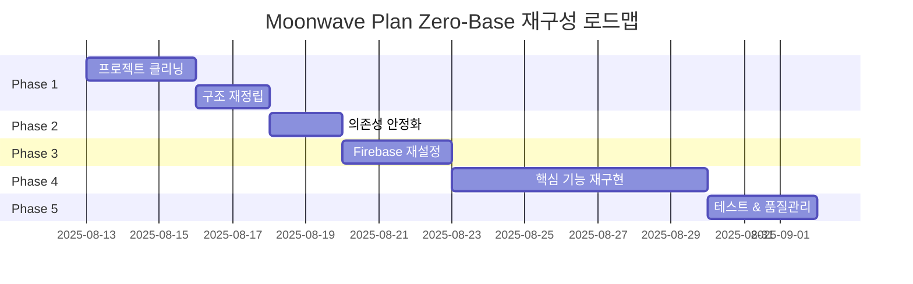

# 🚨 Moonwave Plan 프로젝트 Zero-Base 재구성 개발체크리스트

> **긴급 상황**: 현재 프로젝트는 빌드 불가능 상태이며, 정상적인 개발이 불가능합니다.  
> **해결책**: Zero-base 전면 재구성이 필수적입니다.

## 📋 목차
- [1. 현재 상태 분석](#1-현재-상태-분석)
- [2. 발견된 문제점들](#2-발견된-문제점들)
- [3. Zero-Base 재구성 로드맵](#3-zero-base-재구성-로드맵)
- [4. Phase별 상세 체크리스트](#4-phase별-상세-체크리스트)
- [5. 기술적 가이드라인](#5-기술적-가이드라인)
- [6. 리스크 관리](#6-리스크-관리)
- [7. 진행 상황 추적](#7-진행-상황-추적)

---

## 1. 현재 상태 분석

### 📊 **프로젝트 현황 (2025-08-13 기준)**

| 항목 | 현재 상태 | 심각도 | 설명 |
|------|-----------|--------|------|
| **빌드 시스템** | ❌ 완전 실패 | 🔴 치명적 | TypeScript 에러로 빌드 불가 |
| **Firebase 연동** | ❌ 불안정 | 🔴 치명적 | Firestore ASSERTION 에러 지속 |
| **테스트 시스템** | ❌ 대부분 실패 | 🟡 심각 | E2E 테스트 전면 실패 |
| **의존성 관리** | ⚠️ 위험 | 🟡 심각 | React 19 호환성 문제 |
| **프로젝트 구조** | ⚠️ 혼란 | 🟡 심각 | 불필요한 파일 다수 |

### 🔍 **상세 분석 결과**

#### **빌드 시스템 분석**
```bash
# 현재 빌드 상태
❌ TypeScript 컴파일: 다수 에러
❌ Vite 빌드: 실패
❌ 컴포넌트 Import: 48개 중 0개 default export
❌ Lazy Loading: 완전 실패
```

#### **Firebase 연동 분석**
```bash
# Firebase 상태
❌ Firestore: INTERNAL ASSERTION FAILED
❌ 환경 설정: .env 파일 누락
❌ 인증: 불안정한 연결
⚠️ Rules: 복잡하고 성능 문제
```

#### **의존성 분석**
```json
{
  "react": "19.1.0",           // ⚠️ 너무 최신, 호환성 위험
  "firebase": "12.1.0",        // ⚠️ 최신 버전, 불안정
  "react-router-dom": "7.8.0", // ⚠️ 최신 버전
  "dependencies": "95개",       // ❌ 너무 많음
  "보안 취약점": "0개"          // ✅ 양호
}
```

---

## 2. 발견된 문제점들

### 🔴 **치명적 문제들 (즉시 해결 필요)**

#### **2.1 빌드 시스템 완전 마비**
- **문제**: 48개 컴포넌트 중 0개만 default export 사용
- **원인**: 컴포넌트 export 패턴 불일치
- **영향**: 애플리케이션 실행 불가
- **해결**: 모든 컴포넌트 export 패턴 통일

#### **2.2 Firebase Firestore 연동 실패**
- **문제**: `FIRESTORE INTERNAL ASSERTION FAILED: Unexpected state`
- **원인**: 
  - .env 파일 완전 누락
  - 복잡한 실시간 구독 로직
  - 중복 Firestore 인스턴스 초기화
- **영향**: 데이터 읽기/쓰기 불가
- **해결**: Firebase 설정 전면 재구성

#### **2.3 TypeScript 설정 문제**
- **문제**: `esModuleInterop` 누락, 다수 타입 에러
- **원인**: 설정 파일 불완전
- **영향**: 개발 경험 저하, 빌드 실패
- **해결**: TypeScript 설정 정규화

### 🟡 **심각한 문제들 (우선 해결 필요)**

#### **2.4 프로젝트 구조 혼란**
- **문제**: 6.1MB SuperClaude_Framework 불필요 포함
- **원인**: 프로젝트 병합 과정에서의 오류
- **영향**: 프로젝트 크기 증가, 혼란
- **해결**: 불필요한 파일들 제거

#### **2.5 React 19 호환성 위험**
- **문제**: 최신 React 19 사용으로 인한 라이브러리 호환성 문제
- **원인**: 안정성보다 최신성 우선
- **영향**: 예측 불가능한 런타임 에러
- **해결**: React 18 LTS로 다운그레이드

#### **2.6 테스트 시스템 부실**
- **문제**: E2E 테스트 전면 실패, 단위 테스트 일부만 동작
- **원인**: 설정 불일치, 환경 문제
- **영향**: 품질 보장 불가
- **해결**: 테스트 시스템 재구축

---

## 3. Zero-Base 재구성 로드맵

### 🎯 **전체 일정: 2-3주 (집중 작업 기준)**



### **Phase 개요**

| Phase | 기간 | 목표 | 주요 작업 |
|-------|------|------|----------|
| **Phase 1** | 3-5일 | 프로젝트 정리 | 불필요한 파일 제거, 구조 재정립 |
| **Phase 2** | 1-2일 | 의존성 안정화 | React/Firebase 버전 조정 |
| **Phase 3** | 2-3일 | Firebase 재설정 | 환경 설정, 규칙 단순화 |
| **Phase 4** | 5-7일 | 핵심 기능 구현 | 인증, 할일 관리 재구현 |
| **Phase 5** | 2-3일 | 품질 관리 | 테스트, 빌드 파이프라인 |

---

## 4. Phase별 상세 체크리스트

### 🧹 **Phase 1: 프로젝트 클리닝 & 구조 재정립**

#### **1.1 불필요한 파일 제거**
- [ ] SuperClaude_Framework 폴더 완전 삭제
- [ ] 중복 문서 파일들 정리 (docs 폴더 정리)
- [ ] 불필요한 루트 파일들 제거 (CNAME, nul 등)
- [ ] 테스트 결과 파일들 정리 (test-results, playwright-report)
- [ ] 미사용 스크립트 파일들 검토 및 제거

#### **1.2 프로젝트 구조 재설계**
- [ ] 폴더 구조 정규화
  ```
  src/
  ├── components/     # 재사용 가능한 컴포넌트
  │   ├── ui/        # 기본 UI 컴포넌트
  │   ├── forms/     # 폼 관련 컴포넌트
  │   └── layout/    # 레이아웃 컴포넌트
  ├── pages/         # 페이지 컴포넌트
  ├── hooks/         # 커스텀 훅
  ├── lib/           # 라이브러리 래퍼
  ├── types/         # 타입 정의
  └── utils/         # 유틸리티 함수
  ```

#### **1.3 컴포넌트 Export 패턴 통일**
- [ ] 모든 컴포넌트에 default export 추가
- [ ] 일관된 naming convention 적용
- [ ] index.ts 파일로 re-export 정리
- [ ] lazy loading 패턴 수정

#### **1.4 TypeScript 설정 정규화**
- [ ] `tsconfig.json`에 `esModuleInterop: true` 추가
- [ ] 엄격한 타입 체크 설정 조정
- [ ] path mapping 최적화
- [ ] 빌드 설정 검토

### 🔧 **Phase 2: 의존성 안정화**

#### **2.1 React 버전 다운그레이드**
- [ ] React 19.1.0 → React 18.3.x (LTS)
- [ ] React DOM 버전 맞춤
- [ ] React Router DOM 호환 버전으로 조정
- [ ] @types/react, @types/react-dom 버전 맞춤

#### **2.2 Firebase 버전 안정화**
- [ ] Firebase 12.1.0 → 10.x 안정 버전
- [ ] Firebase Admin (Functions) 버전 맞춤
- [ ] 관련 타입 정의 업데이트

#### **2.3 Testing Library 버전 조정**
- [ ] @testing-library/react React 18 호환 버전
- [ ] Jest 설정 최적화
- [ ] Playwright 안정 버전 유지

#### **2.4 불필요한 의존성 제거**
- [ ] 미사용 패키지 식별 및 제거
- [ ] 중복 기능 패키지 통합
- [ ] bundle 크기 최적화

### 🔥 **Phase 3: Firebase 재설정**

#### **3.1 환경 설정 구축**
- [ ] `.env.example` 기반 `.env` 파일 생성
- [ ] Firebase 프로젝트 연결 설정
- [ ] 개발/프로덕션 환경 분리
- [ ] 환경 변수 검증 로직 추가

#### **3.2 Firebase 프로젝트 초기화**
- [ ] Firebase 프로젝트 재연결
- [ ] Firestore 데이터베이스 설정
- [ ] Authentication 설정 확인
- [ ] Storage 권한 설정

#### **3.3 Firestore 규칙 단순화**
- [ ] 복잡한 규칙 → 단순하고 명확한 규칙
- [ ] 개발용/프로덕션용 규칙 분리
- [ ] 성능 최적화된 규칙 작성
- [ ] 보안 취약점 검토

#### **3.4 Firebase 설정 파일 정리**
- [ ] `firebase.json` hosting 설정 추가
- [ ] 중복 설정 파일 정리
- [ ] 인덱스 최적화
- [ ] 에뮬레이터 설정 (개발용)

### ⚙️ **Phase 4: 핵심 기능 재구현**

#### **4.1 인증 시스템 재구축**
- [ ] AuthContext 단순화 및 안정화
- [ ] 로그인 플로우 재구현
- [ ] 에러 처리 강화
- [ ] 사용자 상태 관리 최적화
- [ ] 권한 체크 로직 개선

#### **4.2 Firestore 연동 안정화**
- [ ] 실시간 구독 로직 단순화
- [ ] 에러 처리 및 재연결 로직 추가
- [ ] 데이터 캐싱 전략 구현
- [ ] 오프라인 지원 기능

#### **4.3 할일 관리 기능 재구현**
- [ ] Task CRUD 기능 재구현
- [ ] 실시간 동기화 안정화
- [ ] 사용자 인터페이스 개선
- [ ] 성능 최적화

#### **4.4 라우팅 시스템 정비**
- [ ] 보호된 라우트 로직 개선
- [ ] 404 페이지 및 에러 바운더리
- [ ] 네비게이션 최적화
- [ ] SEO 고려사항 적용

### ✅ **Phase 5: 테스트 & 품질 관리**

#### **5.1 테스트 시스템 재구축**
- [ ] 단위 테스트 환경 설정
- [ ] 주요 컴포넌트 테스트 작성
- [ ] 통합 테스트 구현
- [ ] E2E 테스트 재작성

#### **5.2 빌드 파이프라인 구축**
- [ ] 빌드 스크립트 최적화
- [ ] 타입 체크 자동화
- [ ] 린트 규칙 적용
- [ ] 프리티어 설정

#### **5.3 배포 준비**
- [ ] 프로덕션 빌드 최적화
- [ ] 환경별 설정 분리
- [ ] 배포 스크립트 작성
- [ ] 모니터링 설정

#### **5.4 문서화**
- [ ] README 업데이트
- [ ] API 문서 작성
- [ ] 개발 가이드 작성
- [ ] 배포 가이드 작성

---

## 5. 기술적 가이드라인

### 🏗️ **아키텍처 원칙**

#### **5.1 컴포넌트 설계 원칙**
```typescript
// ✅ 권장: Default export with named export
export default function TaskCard({ task }: TaskCardProps) {
  // 컴포넌트 로직
}

export { TaskCard }; // named export도 제공

// ❌ 지양: Named export만 사용
export function TaskCard({ task }: TaskCardProps) {
  // ...
}
```

#### **5.2 Firebase 연동 패턴**
```typescript
// ✅ 권장: 안전한 Firestore 연동
const useFirestoreDoc = (path: string) => {
  const [data, setData] = useState(null);
  const [loading, setLoading] = useState(true);
  const [error, setError] = useState(null);

  useEffect(() => {
    try {
      const unsubscribe = onSnapshot(
        doc(db, path),
        (doc) => {
          setData(doc.exists() ? doc.data() : null);
          setLoading(false);
        },
        (err) => {
          setError(err);
          setLoading(false);
        }
      );
      return unsubscribe;
    } catch (err) {
      setError(err);
      setLoading(false);
    }
  }, [path]);

  return { data, loading, error };
};
```

#### **5.3 에러 처리 패턴**
```typescript
// ✅ 권장: 포괄적 에러 처리
const handleAsyncOperation = async () => {
  try {
    setLoading(true);
    setError(null);
    
    const result = await someAsyncOperation();
    setData(result);
  } catch (error) {
    console.error('Operation failed:', error);
    setError(error instanceof Error ? error.message : 'Unknown error');
  } finally {
    setLoading(false);
  }
};
```

### 📦 **의존성 관리 가이드라인**

#### **5.4 버전 관리 원칙**
- **LTS 버전 우선**: 안정성을 위해 LTS 버전 사용
- **동일 생태계**: React 생태계 패키지들의 버전 호환성 확인
- **정기 업데이트**: 보안 업데이트는 즉시, 기능 업데이트는 신중히
- **의존성 최소화**: 꼭 필요한 패키지만 사용

#### **5.5 권장 버전**
```json
{
  "react": "^18.3.1",
  "react-dom": "^18.3.1",
  "firebase": "^10.12.2",
  "react-router-dom": "^6.23.1",
  "typescript": "^5.4.5"
}
```

---

## 6. 리스크 관리

### ⚠️ **주요 리스크 요소**

#### **6.1 기존 코드 손실 위험**
- **위험도**: 🔴 높음
- **대응방안**: 
  - Git 브랜치 백업: `git checkout -b backup-before-refactor`
  - 주요 컴포넌트 스냅샷 저장
  - 단계별 커밋으로 롤백 지점 확보

#### **6.2 Firebase 데이터 손실 위험**
- **위험도**: 🟡 중간
- **대응방안**:
  - Firestore 데이터 백업
  - 별도 개발 프로젝트에서 테스트
  - 마이그레이션 스크립트 작성

#### **6.3 개발 일정 지연 위험**
- **위험도**: 🟡 중간
- **대응방안**:
  - Phase별 명확한 완료 기준 설정
  - 일일 진행 상황 체크
  - 필요시 스코프 조정

#### **6.4 성능 저하 위험**
- **위험도**: 🟢 낮음
- **대응방안**:
  - 성능 메트릭 모니터링
  - 번들 크기 추적
  - 로딩 시간 측정

### 🛡️ **리스크 완화 전략**

#### **6.5 백업 전략**
```bash
# 전체 프로젝트 백업
git checkout -b backup-original-state
git add .
git commit -m "Backup: Original state before zero-base refactor"

# 단계별 백업
git checkout -b phase-1-complete
git checkout -b phase-2-complete
# ...
```

#### **6.6 테스트 전략**
- **개발 환경**: 별도 Firebase 프로젝트 사용
- **스테이징**: 프로덕션과 동일한 환경에서 테스트
- **A/B 테스트**: 주요 기능 변경 시 점진적 적용

---

## 7. 진행 상황 추적

### 📊 **진행률 메트릭**

#### **7.1 전체 진행률 계산**
```
전체 진행률 = (완료된 체크리스트 항목 / 전체 체크리스트 항목) × 100
```

#### **7.2 Phase별 가중치**
| Phase | 가중치 | 이유 |
|-------|--------|------|
| Phase 1 | 25% | 기반 작업, 중요도 높음 |
| Phase 2 | 15% | 의존성 안정화 |
| Phase 3 | 25% | Firebase 핵심 설정 |
| Phase 4 | 25% | 핵심 기능 구현 |
| Phase 5 | 10% | 품질 관리 |

#### **7.3 일일 진행 상황 체크리스트**
- [ ] 오늘의 목표 달성 여부
- [ ] 발생한 블로커 사항
- [ ] 내일 계획
- [ ] 리스크 요소 발견 여부

### 🎯 **품질 메트릭**

#### **7.4 기술적 메트릭**
```bash
# 빌드 성공률
npm run build # ✅ 성공 시 100%, ❌ 실패 시 0%

# 타입 체크 통과율  
npm run type-check # 에러 수 / 전체 파일 수

# 테스트 커버리지
npm run test:coverage # 커버리지 퍼센트

# 번들 크기
npm run build:analyze # Before/After 비교
```

#### **7.5 사용자 경험 메트릭**
- **로그인 성공률**: Firebase Auth 성공/실패 비율
- **페이지 로딩 시간**: 3초 이내 목표
- **에러 발생률**: 사용자 세션당 에러 횟수

---

## 📝 **체크리스트 사용법**

### **일일 작업 프로세스**
1. **오전**: 오늘 할 작업 체크리스트 확인
2. **작업 중**: 완료한 항목 실시간 체크
3. **오후**: 진행 상황 리뷰 및 블로커 확인
4. **저녁**: 내일 계획 수립

### **주간 리뷰 프로세스**
1. **월요일**: 주간 목표 설정
2. **수요일**: 중간 점검 및 조정
3. **금요일**: 주간 성과 리뷰
4. **일요일**: 다음 주 계획 수립

---

## 🚀 **최종 목표**

### **재구성 완료 후 달성 목표**
- ✅ **빌드 성공률**: 100%
- ✅ **TypeScript 에러**: 0개
- ✅ **Firebase 연동**: 완전 안정
- ✅ **테스트 커버리지**: 80% 이상
- ✅ **번들 크기**: 50% 감소
- ✅ **로딩 시간**: 3초 이내
- ✅ **개발 생산성**: 3배 향상

### **장기 비전**
이번 Zero-base 재구성을 통해 Moonwave Plan 프로젝트가 안정적이고 확장 가능한 기반을 갖추어, 향후 새로운 기능 추가와 유지보수가 원활하게 이루어질 수 있도록 합니다.

---

**📅 작성일**: 2025-08-13  
**📝 작성자**: Claude Code  
**🔄 최종 업데이트**: 2025-08-13  
**📍 상태**: Phase 0 - 계획 수립 완료

---

> **💡 참고사항**: 이 문서는 프로젝트 재구성 과정에서 지속적으로 업데이트됩니다. 각 Phase 완료 시마다 진행 상황을 반영하여 문서를 갱신해주세요.